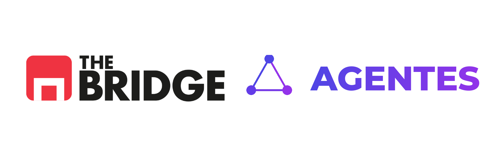

# Function calling y ciclo

**Function calling** (a veces *tool calling*) es el mecanismo de la API del LLM para:

1. Recibir la lista de tools disponibles.
2. Responder con un **function call** estructurado (nombre + args), no solo texto.
3. Recibir después el **resultado** de la tool y continuar.

Por ejemplo, en Gemini lo haces con el SDK `google-genai`: declaras `FunctionDeclaration` / `Tool` y pasas `tools=` en la config.

---

## Ciclo de funcionamiento de un agente con function calling

Podemos ver cómo funciona el ciclo de funcionamiento de un agente con function calling. El agente recibe una pregunta del usuario y debe responderla. Para ello, el agente puede usar las tools disponibles.

```text
Usuario: "¿Qué hora es ahora?"
        │
        ▼
   [LLM + tools declaradas]
        │
        ├── function_call: hora_actual()
        │         │
        │         ▼
        │   Python ejecuta hora_actual()
        │         │
        │         ▼
        │   "2026-08-06T15:04:12"
        │         │
        │         ▼
        └── [LLM ve el resultado]
                  │
                  ▼
            Texto final: "Son las 15:04…"
```

Puede haber **varias** vueltas (varias tools) antes del texto final. Esto se suele limitar con un parámetro `max_steps` en tu script. Este parámetro es un límite para evitar que el agente use demasiadas tools y se quede en un bucle infinito.

---

## Manual vs automático (AFC)

El SDK de Gemini puede ejecutar tools **solo** (*automatic function calling*, AFC). En ese modo el SDK orquesta el bucle por ti.

En este sprint (proyecto cultural y Live Review) **desactivamos el AFC** (`disable=True`) y hacemos el loop **a mano** (`run_tool_loop`) para ver allowlist, traza y `max_steps`:

1. Llamada al modelo → ¿pide tool (`function_call`)?
2. Si sí: **tú** ejecutas la función en Python (tras allowlist / validación).
3. Devuelves el resultado como `Part.from_function_response` (o equivalente).
4. Vuelves a llamar al modelo con el historial actualizado.
5. Si no pide tool → texto final.

El AFC automático es un atajo cómodo para demos; **el control** (allowlist, validación, traza, `max_steps`) lo quieres ver y decidir tú. Por eso el modo **manual** es el de los proyectos del sprint.

Puede haber un warning del SDK al desactivar AFC: **no es un error** de vuestro código.

---

## Contenidos que hay que encadenar

En cada paso el historial crece:

| Rol | Qué lleva |
|-----|-----------|
| `user` | Pregunta del humano |
| `model` | El `function_call` (o el texto final) |
| `tool` | El resultado de Python |

Sin ese encadenamiento, el modelo “olvida” que pidió la tool.

---

## Errores frecuentes

1. **No devolver el resultado** al modelo → se queda a medias o inventa.
2. **Nombre distinto** en declaración vs función Python → fallos silenciosos.
3. **Meter dumps enormes** como resultado de tool → ruido y coste; resume.
4. **Confiar en el LLM para la hora** sin tool → demos que “funcionan” pero mienten.

---

## En resumen

Function calling no es magia: es un **protocolo** (pedir → ejecutar → observar → responder). Debemos tener claros estos pasos para poder hacer un agente con function calling.
