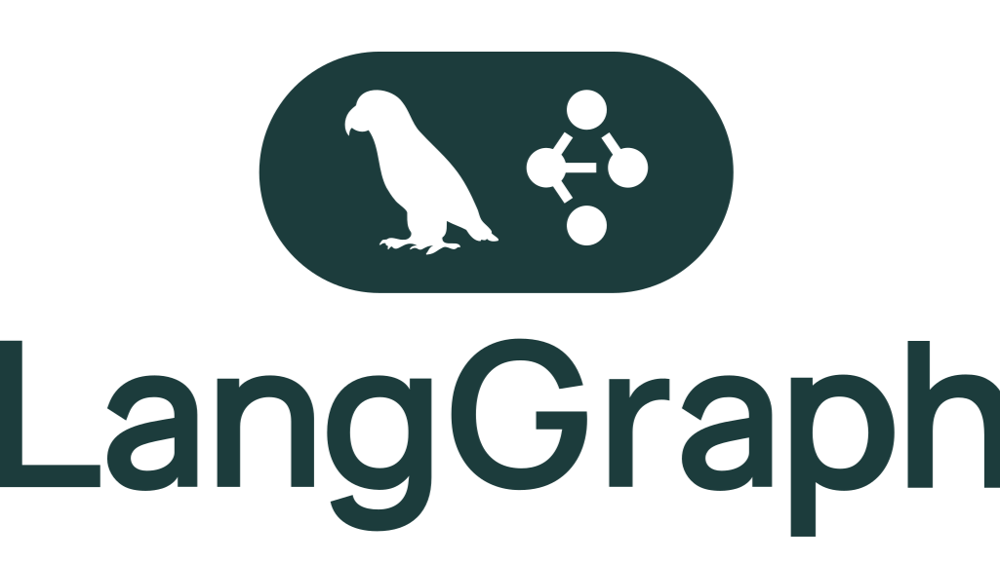
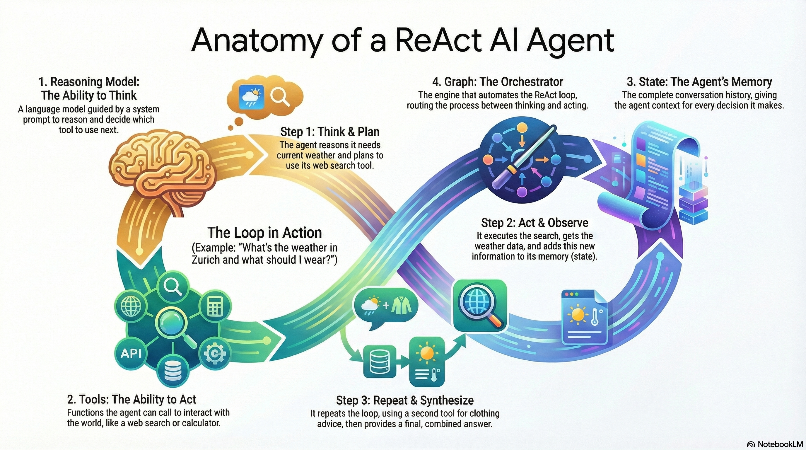
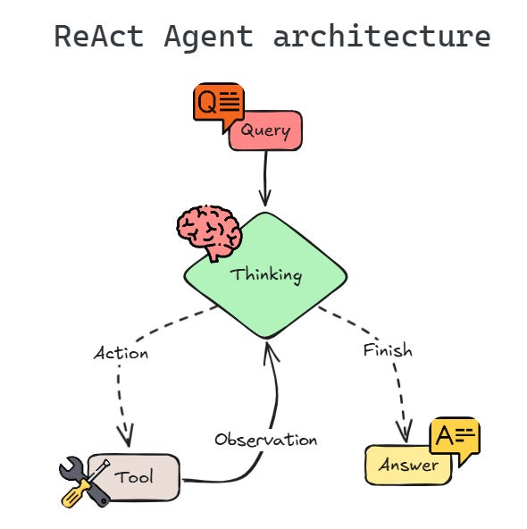

# ReAct con tools en LangGraph



**ReAct** es Reason + Act: el modelo **razona** si le faltan datos y **actúa** pidiendo una tool. Un programa ejecuta esa tool y el resultado vuelve al modelo. Se repite hasta que ya hay texto, o hasta un tope.

Ese ciclo puede vivir en un `while`. LangGraph lo dibuja como grafo: dos nodos y una flecha que **vuelve**.

```text
[START] → [agent] ──┬── ¿tool_calls? sí ──► [tools] ──► [agent]
                    │
                    └── no ──► [END]
```





[LangGraph](https://docs.langchain.com/oss/python/langgraph/overview) orquesta. No elige la tool ni decide cuándo parar: eso sigue en el modelo (la petición) y en Python (la ejecución y el tope).

---

## Un turno, mensaje a mensaje

Pregunta: «¿cuánto es 3 elevado a 8?». Hay una tool `calcular(expresion)`.

| Paso | Quién | Qué se añade a `messages` | A dónde va el router |
|------|--------|---------------------------|----------------------|
| 0 | Quien llama al grafo | Humano: «¿cuánto es 3 elevado a 8?» · `pasos = 0` | entra en `agent` |
| 1 | Nodo `agent` | Mensaje del modelo con `tool_calls`: `calcular`, args `{"expresion": "3 ** 8"}` | hay `tool_calls` → `tools` |
| 2 | Nodo `tools` | Mensaje de tool: `"Resultado: 6561"`, ligado a esa llamada · `pasos = 1` | flecha fija → `agent` |
| 3 | Nodo `agent` | Mensaje del modelo, solo texto: «3 elevado a 8 es 6561.» | no hay `tool_calls` → `END` |

El modelo no calcula. En el paso 1 solo **pide**. En el paso 2 Python ejecuta. En el paso 3 el modelo ya ve el número y redacta la respuesta.

Si la pregunta necesita dos datos («clima en Madrid y 3⁸»), el ciclo da otra vuelta: `agent` pide la segunda tool, `tools` la ejecuta (`pasos = 2`) y `agent` vuelve a mirar. El texto final sale cuando el último mensaje del modelo no trae `tool_calls`.

---

## Piezas

| Pieza | Rol |
|-------|-----|
| **State** | Lo que viaja entre nodos. Aquí, la lista de mensajes y un contador. |
| **Nodo `agent`** | Llama al LLM con las tools enlazadas (`bind_tools`). |
| **Nodo `tools`** | Ejecuta lo que el modelo pidió y devuelve el texto de cada tool. |
| **Router** | Después de `agent`: si hay `tool_calls`, va a `tools`; si no, a `END`. |
| **Edge de vuelta** | De `tools` a `agent`. Sin esta flecha el modelo no ve el resultado. |
| **Tope** | `pasos`. Cuenta cuántas veces se ha entrado en `tools`. |

---

## Cómo se declara una tool

`@tool` convierte una función de Python en algo que el modelo puede pedir. El **nombre**, los **argumentos** y el **docstring** son lo que el modelo lee para decidir si la usa.

```python
from langchain_core.tools import tool

@tool
def calcular(expresion: str) -> str:
    """Evalúa una expresión matemática sencilla. Ejemplo: '3 ** 8'."""
    return f"Resultado: {eval_seguro(expresion)}"
```

`bind_tools` le pasa esa lista al modelo. A partir de ahí la respuesta puede ser texto o una lista de llamadas.

```python
tools = [calcular, obtener_clima]
llm_con_tools = llm.bind_tools(tools)
```

Una llamada no es la ejecución. Es un dict con id, nombre y args:

```python
{
    "id": "call_1",
    "name": "calcular",
    "args": {"expresion": "3 ** 8"},
}
```

El nodo `tools` responde con un mensaje que cita ese `id`. Si el id no coincide, el modelo no sabe a qué petición corresponde el `"Resultado: 6561"`.

```python
from langchain_core.messages import ToolMessage

ToolMessage(content="Resultado: 6561", tool_call_id="call_1")
```

---

## Estado y reducer

```python
from typing import Annotated, TypedDict
from langgraph.graph.message import add_messages

class Estado(TypedDict):
    messages: Annotated[list, add_messages]  # se acumula
    pasos: int                               # se sustituye
```

Un nodo devuelve solo el **parche**, no el historial entero:

```python
return {"messages": [mensaje_nuevo], "pasos": 1}
```

`add_messages` **añade** `mensaje_nuevo` a la lista que ya había. Sin reducer, esa lista de un elemento pisaría al humano y a las tools anteriores, y el modelo se quedaría sin contexto.

`pasos` no lleva reducer: cada escritura sustituye el número. Sirve para contar vueltas por `tools`.

La clave se llama `messages` porque el nodo de tools preconstruido la busca con ese nombre. Otros campos (`pasos`, un plan, una traza) se añaden al mismo `TypedDict`.

---

## Nodo agent

Lee el historial y devuelve **un** mensaje del modelo.

```python
def nodo_agent(estado: Estado) -> dict:
    ai = llm_con_tools.invoke(estado["messages"])
    return {"messages": [ai]}
```

Ese mensaje trae `tool_calls` o trae texto. El nodo `agent` no llama a `calcular`.

---

## Nodo tools

El contrato es el mismo en los dos estilos: leer `tool_calls`, ejecutar, devolver el texto. Cambia quién escribe el bucle.

| Estilo | Qué hace |
|--------|----------|
| **`ToolNode(tools)`** | Lee las llamadas del último mensaje y ejecuta las funciones `@tool`. |
| **Código tuyo** | Recorre las llamadas y ejecuta la tuya (`ejecutar_tool`), con allowlist y validación de argumentos. |

`ToolNode` es un nodo del grafo. El contador va en un envoltorio, porque `ToolNode` no conoce `pasos`:

```python
from langgraph.prebuilt import ToolNode

def nodo_tools(estado: Estado) -> dict:
    salida = ToolNode(tools).invoke(estado)
    return {
        "messages": salida["messages"],
        "pasos": int(estado.get("pasos") or 0) + 1,
    }
```

El mismo `for` puede vivir **dentro** de otro nodo, cuando el grafo de fuera enruta roles y este nodo solo necesita tools para hacer su parte. Ahí no hay nodo `tools` en el grafo: el bucle es Python.

```python
def nodo_con_bucle(estado: Estado) -> dict:
    mensajes = list(estado["messages"])
    for _ in range(MAX_STEPS):
        ai = llm_con_tools.invoke(mensajes)
        mensajes.append(ai)
        if not ai.tool_calls:
            break
        for llamada in ai.tool_calls:
            texto = ejecutar_tool(llamada["name"], llamada["args"])
            mensajes.append(
                ToolMessage(content=texto, tool_call_id=llamada["id"])
            )
    return {"messages": mensajes}
```

---

## Router

El router no es un nodo. Es la función que, al salir de `agent`, elige el siguiente nombre.

```python
from typing import Literal

MAX_STEPS = 6

def router(estado: Estado) -> Literal["tools", "__end__"]:
    if int(estado.get("pasos") or 0) >= MAX_STEPS:
        return "__end__"
    ultimo = estado["messages"][-1]
    if getattr(ultimo, "tool_calls", None):
        return "tools"
    return "__end__"
```

```text
START → agent
agent → router → tools | END
tools → agent          # siempre, para que el modelo lea el resultado
```

```python
from langgraph.graph import START, StateGraph

grafo = StateGraph(Estado)
grafo.add_node("agent", nodo_agent)
grafo.add_node("tools", nodo_tools)
grafo.add_edge(START, "agent")
grafo.add_conditional_edges("agent", router)
grafo.add_edge("tools", "agent")
app = grafo.compile()
```

`__end__` es la salida del grafo. Tras `tools` la flecha es fija: no hay router ahí.

---

## Parada

| Señal | Quién la mira |
|-------|----------------|
| El último mensaje no tiene `tool_calls` | El router manda a `END`. Hay respuesta. |
| `pasos >= MAX_STEPS` | Python, en el router, **antes** de obedecer otro `tool_calls`. |
| `recursion_limit` | LangGraph, si un bucle supera el tope del runtime. |

No hace falta una tool `marcar_done`. El fin es “el modelo ya escribió texto” o “se acabó el cupo de `pasos`”.

El tope se mira al salir de `agent`, con el contador que dejó la vuelta anterior por `tools`. Así un modelo que pide tools sin parar no da más de `MAX_STEPS` ejecuciones.

---

## Decisión y ejecución

El LLM elige el nombre y los argumentos. Python ejecuta, bloquea (la tool no está en la allowlist) o anota un error. En los tres casos devuelve un mensaje de tool: el modelo sigue y puede pedir otra cosa o cerrar en texto.

---

## Errores típicos

- Devolver en `messages` el historial **entero** teniendo `add_messages`: cada mensaje se duplica.
- Quitar `add_messages`: el parche de un mensaje pisa la lista y se pierde la pregunta.
- Olvidar `pasos`: el modelo puede pedir tools en bucle.
- Ejecutar la tool dentro de `agent`: se mezclan la decisión y la ejecución.
- Un mensaje de tool sin el `tool_call_id` de la llamada: el modelo no casa el resultado con el pedido.
- Una flecha `tools` → `END`: el resultado no vuelve al modelo y nadie redacta la respuesta.

---

## Leer más

| Tema | Doc |
|------|-----|
| Overview | https://docs.langchain.com/oss/python/langgraph/overview |
| Graph API (estado, nodos, edges) | https://docs.langchain.com/oss/python/langgraph/graph-api |
| Reducers y `add_messages` | https://docs.langchain.com/oss/python/langgraph/graph-api |
| Montar ramas y bucles | https://docs.langchain.com/oss/python/langgraph/use-graph-api |
| Agentes, tools y `ToolNode` | https://docs.langchain.com/oss/python/langgraph/workflows-agents |

---

## Objetivos

- [ ] Recorro un turno: humano → `tool_calls` → resultado → texto → `END`.
- [ ] Explico por qué `messages` usa `add_messages` y `pasos` no.
- [ ] Distingo la llamada (`name`, `args`, `id`) del mensaje de tool que la contesta.
- [ ] Distingo `ToolNode` de un `for` de tools escrito dentro de otro nodo.
- [ ] Sé dónde corta Python el bucle.

## Para llevarnos

1. ReAct es un bucle: pedir, ejecutar, volver a leer.
2. El grafo encadena. La allowlist y `pasos` siguen en Python.
3. El mismo contrato cabe en un nodo `tools` o en un `for` dentro de otro nodo.
