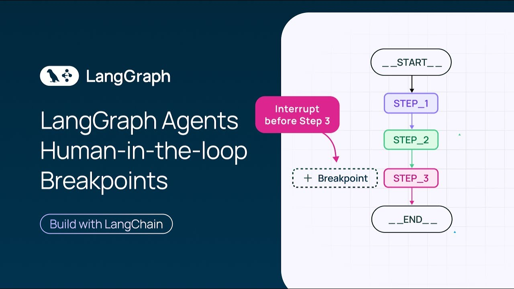
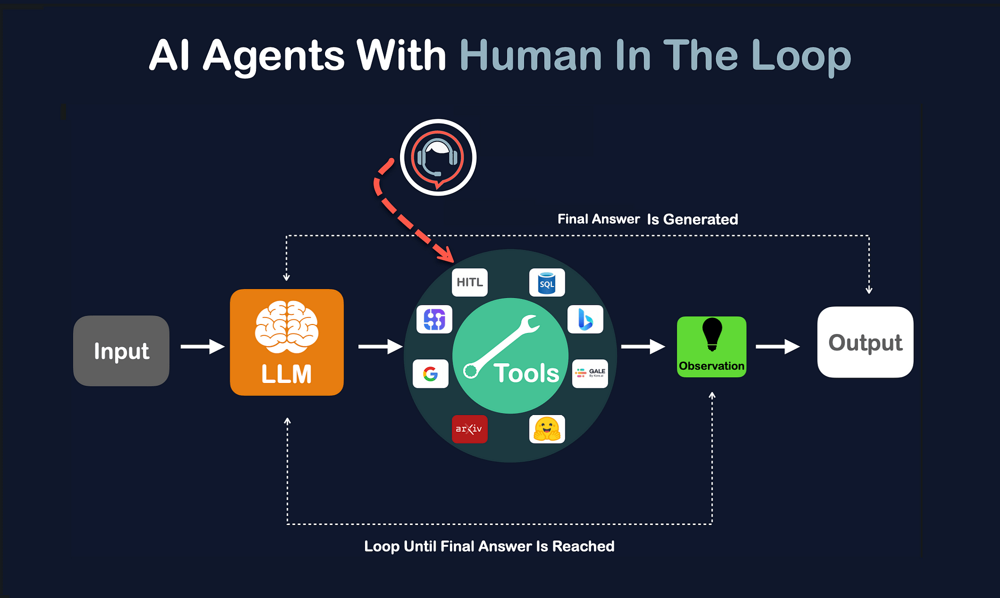

# Persistencia, HITL y límites

Un `invoke` sin memoria **empieza de cero**: el grafo no recuerda el turno anterior. Y, si no lo paras, corre hasta `END` aunque el siguiente paso sea sensible (cerrar un plan, reservar, publicar).

Dos mecanismos cubren eso:

1. **Checkpoints** — una foto del State después de cada paso, atada a un hilo.
2. **Human-in-the-loop** — el grafo se detiene, una persona decide, el mismo hilo continúa.

Los límites (allowlist, tope de pasos, `done`) siguen en Python. El grafo los coloca en nodos y routers; no los inventa.



---

## Checkpoints y `thread_id`

```text
invoke (turno 1) → foto del State
invoke (turno 2, mismo thread_id) → parte de esa foto
invoke (otro thread_id) → hilo vacío
```

```python
from langgraph.checkpoint.memory import MemorySaver

app = grafo.compile(checkpointer=MemorySaver())
config = {"configurable": {"thread_id": "hilo-1"}}

app.invoke({"messages": [primer_mensaje]}, config)
app.invoke({"messages": [segundo_mensaje]}, config)
```

| Concepto | Qué es |
|----------|--------|
| **Checkpoint** | Foto del State tras un paso del grafo. |
| **`thread_id`** | Identificador del hilo. Dos ids = dos conversaciones. |
| **`MemorySaver`** | Checkpoints en RAM. Se pierden al cerrar el proceso. |

Con checkpointer, el `config` con `thread_id` va en **cada** `invoke`.

```python
foto = app.get_state(config)
# foto.values → State actual del hilo
# foto.next   → nodos que tocaría ejecutar ahora (vacío si ya terminó)
```

`get_state` no llama al modelo. Sirve para inspeccionar un plan pendiente o depurar.

---

## Dos capas de memoria

No son lo mismo.

| Capa | Qué recuerda | Cuándo |
|------|----------------|--------|
| **Reducer** (`add_messages`) | Acumula mensajes **dentro** del State de una corrida | Al devolver un parche desde un nodo |
| **Checkpointer** | El State **entre** un `invoke` y el siguiente | Al compilar con `MemorySaver` |

Sin reducer, un nodo pisa la lista. Sin checkpointer, el siguiente `invoke` no ve el turno anterior aunque el reducer esté bien.

La pantalla de un chat (burbujas) puede ser otra lista, solo de interfaz. El State del grafo es el que leen los nodos.

---

## Human-in-the-loop

HITL (*human-in-the-loop*) es una **pausa del grafo** antes de un paso que no debe ocurrir solo: cerrar un plan, reservar, publicar. El modelo puede proponer. Una persona aprueba o rechaza. El mismo hilo continúa.



```text
START → [proponer] → (PAUSA) → [aplicar] → END
                      ↑
              interrupt_before=["aplicar"]
```

El grafo de la pausa es lineal a propósito. No hace falta el bucle agent ↔ tools para ver la decisión humana.

| Pieza | Qué hace |
|-------|----------|
| Nodo `proponer` | El modelo escribe el plan. Deja `aprobado=False`. |
| `interrupt_before=["aplicar"]` | El grafo **no entra** en `aplicar` hasta que alguien reanude. |
| Nodo `aplicar` | Lee `aprobado`. Cierra el plan o deja constancia del rechazo. |
| `MemorySaver` | Guarda la foto de la pausa. Sin checkpointer no hay dónde pararse. |

```python
class EstadoPlan(TypedDict):
    pedido: str
    plan: str
    aprobado: bool    # lo escribe la persona, no el modelo
    resultado: str    # lo escribe aplicar, después de la pausa
```

```python
app = grafo.compile(
    checkpointer=MemorySaver(),
    interrupt_before=["aplicar"],
)
```

### Qué hay en la pausa

El primer `invoke` ejecuta `proponer` y se detiene. `get_state` no llama al modelo: lee la foto.

| Campo | En la pausa |
|-------|-------------|
| `next` | Incluye `"aplicar"`: es el nodo que falta. |
| `plan` | Ya está escrito. |
| `resultado` | Vacío: `aplicar` no ha corrido. |
| `aprobado` | `False`, el valor con el que salió `proponer`. |

```python
config = {"configurable": {"thread_id": "plan-1"}}
app.invoke(
    {"pedido": "Tarde en Madrid, presupuesto medio.", "plan": "", "aprobado": False, "resultado": ""},
    config,
)
foto = app.get_state(config)
# foto.next → ("aplicar",)
# foto.values["plan"] → texto del modelo
# foto.values["resultado"] → ""
```

Quien llama al grafo (una UI, un script) muestra ese plan y espera un botón. No manda otro mensaje al modelo para preguntar “¿sigo?”.

### Aprobar

La decisión entra con `update_state`. `invoke(None, config)` reanuda **el mismo** `thread_id`. `None` significa que no hay pedido nuevo: se sigue desde la pausa.

```python
app.update_state(config, {"aprobado": True})
final = app.invoke(None, config)
# final["resultado"] → plan cerrado
# get_state(config).next → ()  el grafo terminó
```

`aplicar` corre entonces. Ve `aprobado=True` y escribe el resultado de cierre.

### Rechazar

Rechazar es la misma pausa y el mismo nodo. Cambia el booleano.

Otro `thread_id` es otra conversación: no mezcla el plan ya aprobado con este.

```python
config_no = {"configurable": {"thread_id": "plan-2"}}
app.invoke({...}, config_no)                 # proponer y pausar
app.update_state(config_no, {"aprobado": False})
app.invoke(None, config_no)                  # aplicar ve False
```

`aplicar` **sí se ejecuta** al reanudar. Dentro decide no cerrar y deja un resultado de rechazo. La pausa no salta el nodo: impide entrar en él hasta que la persona haya escrito `aprobado`.

```text
aprobado=True   → aplicar cierra el plan
aprobado=False  → aplicar deja constancia del rechazo
```

### Quién decide

| Quién | Qué escribe |
|-------|-------------|
| Nodo `proponer` (modelo) | `plan` |
| Quien llama al grafo | `aprobado`, vía `update_state` |
| Nodo `aplicar` (Python) | `resultado` |

El modelo no vota. Si `aprobado` lo rellenara el propio nodo `proponer` con un “sí” del LLM, la pausa no serviría de nada.

### Otra forma en la documentación actual

La guía de interrupts también muestra `interrupt()` **dentro** de un nodo. El valor de la persona llega al reanudar con `Command(resume=...)`. Es la misma idea: parar, esperar, seguir en el mismo hilo. Aquí la pausa se declara en el `compile`, delante de un nodo con nombre (`interrupt_before`).

---

## Límites en el grafo

| Límite | Dónde |
|--------|--------|
| Allowlist / validar argumentos | En la ejecución de la tool |
| Tope de tools | Contador en el State, o un `for` con máximo |
| Tope de un bucle de roles | Contador de iteraciones en el router |
| `done` | Un nodo de Python, después de la pausa si la hay |
| Traza `ok` / `error` / `blocked` | Al ejecutar cada tool |

El modelo no tiene una tool para marcar el proceso como terminado.

---

## Errores típicos

- Compilar con `interrupt_before` y sin checkpointer.
- Reanudar con otro `thread_id`: es otro hilo, no hay pausa que continuar.
- Llamar otra vez a `invoke` con un mensaje nuevo cuando solo había que reanudar (`invoke(None)`).
- Creer que rechazar se salta `aplicar`. El nodo corre igual; mira `aprobado`.
- Dejar que el modelo escriba `aprobado`.
- Confiar en que el modelo pare solo, sin contador.

---

## Leer más

| Tema | Doc |
|------|-----|
| Persistencia (checkpointers, hilos) | https://docs.langchain.com/oss/python/langgraph/persistence |
| Interrupts y human-in-the-loop | https://docs.langchain.com/oss/python/langgraph/interrupts |
| Graph API (`Command`, reanudar) | https://docs.langchain.com/oss/python/langgraph/graph-api |

---

## Objetivos

- [ ] Explico por qué un `invoke` sin checkpointer olvida el turno anterior.
- [ ] Separo reducer y checkpointer.
- [ ] Describo la pausa: `interrupt_before`, qué muestra `get_state`, `update_state`, `invoke(None)`.
- [ ] Distingo aprobar y rechazar: el mismo nodo `aplicar`, otro valor de `aprobado`.
- [ ] Sé que `done` y la allowlist los decide Python.

## Para llevarnos

1. `thread_id` elige qué foto cargar. La pausa y la reanudación usan el mismo.
2. HITL es `proponer` → pausa → decisión humana → `aplicar`. Aprobar y rechazar pasan por ese nodo.
3. La persona escribe `aprobado`. El modelo escribe el plan. Python escribe el resultado.
4. Los topes se calculan en código y viven en el State o en el router.
