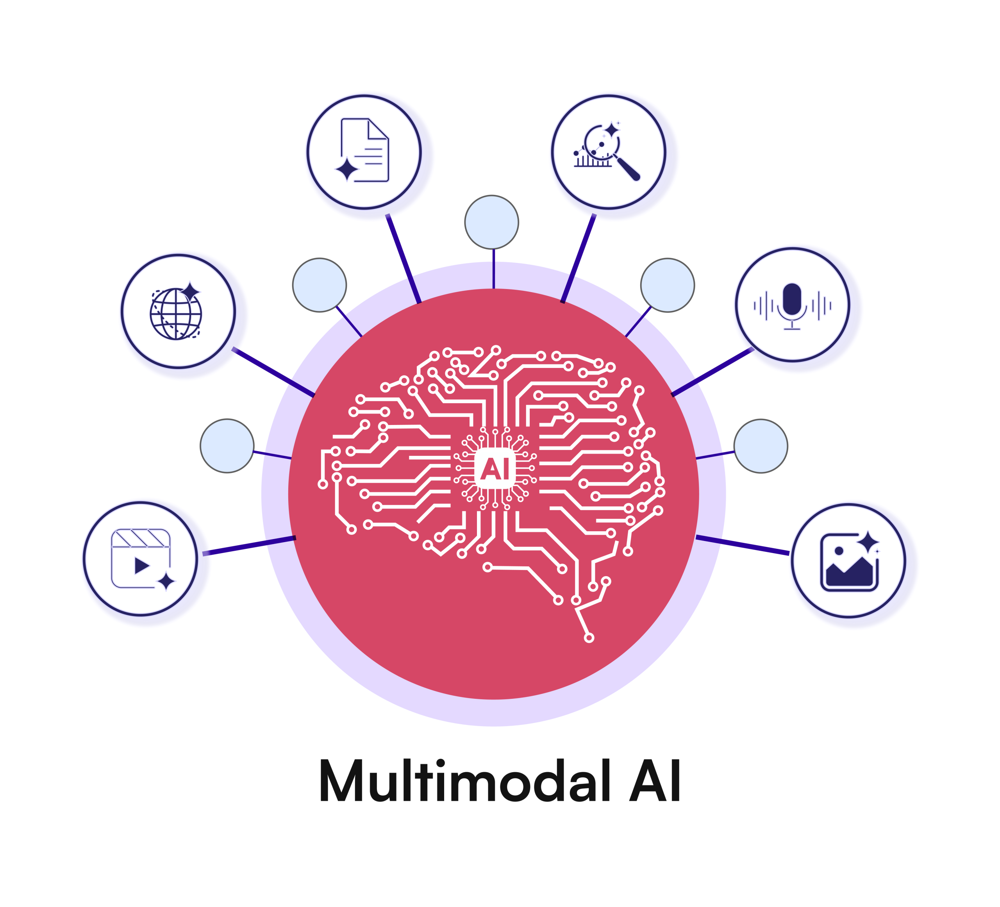

# Multimodal: imagen y texto en un nodo

Multimodal quiere decir que el modelo recibe **más de un tipo de entrada** en la misma llamada. Aquí: una imagen y una pregunta. La respuesta sigue siendo texto.



LangGraph no “ve” la imagen. El grafo solo decide **dónde** ocurre esa llamada. El nodo lee el fichero, monta las partes del mensaje y escribe el texto en el State.

```text
START → leer_imagen → END
            │
            ▼
   bytes de la imagen + pregunta → modelo → State.respuesta
```

Un grafo de un solo nodo basta para ver el contrato. En un grafo mayor, el texto resultante lo leen los nodos siguientes. También puede devolverlo una **tool**: quien la llama recibe texto, igual que con cualquier otra herramienta.

---

## Estado

```python
class EstadoVision(TypedDict):
    ruta_imagen: str
    pregunta: str
    respuesta: str
```

La imagen no hace falta guardarla en el State como bytes si el nodo puede abrir la ruta. El State se queda con la ruta, la pregunta y el texto.

---

## Dentro del nodo

El SDK de Gemini acepta varias **parts** en un mensaje: una con los bytes y el tipo MIME, otra con el texto.

```python
from google import genai
from google.genai import types

cliente = genai.Client(api_key=API_KEY)

def nodo_leer_imagen(estado: EstadoVision) -> dict:
    datos = open(estado["ruta_imagen"], "rb").read()
    mime = "image/png" if estado["ruta_imagen"].endswith(".png") else "image/jpeg"
    respuesta = cliente.models.generate_content(
        model=MODELO,
        contents=[
            types.Content(
                role="user",
                parts=[
                    types.Part.from_bytes(data=datos, mime_type=mime),
                    types.Part.from_text(text=estado["pregunta"]),
                ],
            )
        ],
    )
    return {"respuesta": respuesta.text}
```

```python
grafo = StateGraph(EstadoVision)
grafo.add_node("leer_imagen", nodo_leer_imagen)
grafo.add_edge(START, "leer_imagen")
grafo.add_edge("leer_imagen", END)
app = grafo.compile()
```

El resto del grafo, si lo hay, trabaja con `respuesta`. No vuelve a abrir la imagen.

---

## Como tool

La misma llamada puede ser una función: entra una ruta (o una imagen fija de la aplicación) y sale un string. El modelo la **pide**; Python la **ejecuta** y devuelve el texto al ciclo de tools. El grafo no necesita un nodo especial “visión” si esa tool ya deja el texto en los mensajes.

---

## Límites

- Una llamada imagen → texto. No hay pipeline de visión, ni almacén de medios, ni vídeo.
- Hace falta el MIME correcto (`image/jpeg`, `image/png`). Un tipo mal puesto vacía o rompe la respuesta.
- El modelo describe lo que ve. No consulta solo por la imagen un catálogo: eso sería otra tool, ya con texto.

---

## Errores típicos

- Mandar la ruta como texto y no los bytes: el modelo no abre tu disco.
- Guardar la imagen entera en el historial de mensajes del grafo en cada turno: el estado crece sin aportar.
- Tratar la descripción como un hecho de una base de datos. Es texto del modelo a partir de píxeles.

---

## Leer más

| Tema | Doc |
|------|-----|
| Imagen en la API de Gemini | https://ai.google.dev/gemini-api/docs/image-understanding |
| Un nodo es una función sobre el State | https://docs.langchain.com/oss/python/langgraph/graph-api |
| Tools (si la visión va envuelta en una tool) | https://docs.langchain.com/oss/python/langgraph/workflows-agents |

---

## Objetivos

- [ ] Explico que el grafo orquesta y el modelo recibe parts (imagen + texto).
- [ ] Dibujo un nodo lineal que escribe texto en el State.
- [ ] Sé que esa misma llamada puede ser una tool.

## Para llevarnos

1. Multimodal = más de un tipo de contenido en el mensaje.
2. LangGraph = en qué nodo vive esa llamada.
3. Lo que sigue en el grafo es el texto devuelto.
